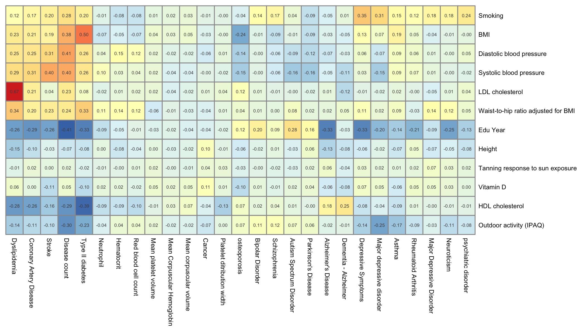
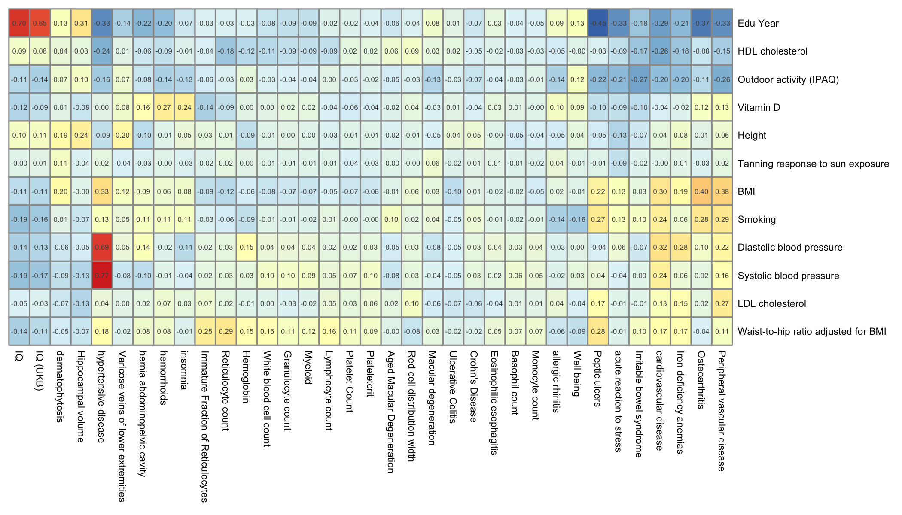

<hr>

*Yan Holtz, Zhihong Zhu, Julanne Frater, Perry Bartlett, Jian Yang, John McGrath*

<hr>


```{r echo=FALSE, warning=FALSE, message=FALSE}
# A few library
library(tidyverse)
library(DT)
library(hrbrthemes)
library(plotly)
library(viridis)
```


#Installing LDSC
***

I lost a few hours of my life installing the [LDSC software]("https://github.com/bulik/ldsc") properly. Here are a few hints to do it faster next time. Important:

- Install anaconda with python **version 2**, not 3
- When calling LDSC, I must use the python version stored in the lDSC folder, not the default one.
```{r, eval=FALSE}
#Delta
cd /shares/compbio/Group-Wray/YanHoltz/SOFT
git clone https://github.com/bulik/ldsc.git

# Then install Anaconda. Warning: must be version 2 of python, not 3.
cd /shares/compbio/Group-Wray/YanHoltz/SOFT
wget https://repo.anaconda.com/archive/Anaconda2-5.1.0-Linux-x86_64.sh
#start installation in /shares/compbio/Group-Wray/YanHoltz/SOFT

# Then follow https://github.com/bulik/ldsc

# To have help:
/shares/compbio/Group-Wray/YanHoltz/SOFT/ldsc/ldsc.py -h

# I also download LD scrore provided by LDSC:
wget https://data.broadinstitute.org/alkesgroup/LDSCORE/eur_w_ld_chr.tar.bz2
tar -xvjf eur_w_ld_chr.tar.bz2
```


#Material
***
LD score regression test is run to check the genetic correlation between Vitamin-D concentration and GWAS summary statistics for traits potentially influenced by vitamin D concentration. Note that all outcome gwases are listed in [supplementary file]() with their associated publication and main features. 75 traits are considered and divided in three categories.

- Primary traits: 28 traits and diseases with a strong prior for vitamin D effect.
- Secondary traits: 35 traits and diseases with no prior for vitamin D effect.
- Risk factors: 12 traits potentially involved in the mechanism.


#Method
***

Here is the script to compute genetic correlation between vitaminD and every other traits based on GWAS summary statistics.

- This one computes it for a specific example.
```{r, eval=FALSE}
# Good folder
cd /shares/compbio/Group-Wray/YanHoltz/VITAMIND_XIA_ET_AL/4_LDSC/GENET_COR

# GWAS result at good format: snpid hg18chr bp a1 a2 or se pval info ngt CEUaf
cat /shares/compbio/Group-Wray/YanHoltz/DATA/GWAS/XiaEtAl_VitaminD/GWAS_vitaminD_XiaEtAL.ma | awk '{print $1, $2, $3, $7, $5, $8}' > input.txt
cat /shares/compbio/Group-Wray/YanHoltz/DATA/GWAS/GWAS_SUMSTAT/alzheimers_igap_2013.txt | awk '{print $1, $2, $3, $7, $5, $8}' > alz.txt

# Munge. Be careful to call the python version which is IN ldsc.
/shares/compbio/Group-Wray/YanHoltz/SOFT/anaconda3/envs/ldsc/bin/python /shares/compbio/Group-Wray/YanHoltz/SOFT/ldsc/munge_sumstats.py \
--sumstats input.txt \
--out input \
--merge-alleles /shares/compbio/Group-Wray/YanHoltz/SOFT/ldsc/eur_w_ld_chr/w_hm3.snplist

# Munge. Be careful to call the python version which is IN ldsc.
/shares/compbio/Group-Wray/YanHoltz/SOFT/anaconda3/envs/ldsc/bin/python /shares/compbio/Group-Wray/YanHoltz/SOFT/ldsc/munge_sumstats.py \
--sumstats alz.txt \
--N 79000 \
--out alz \
--merge-alleles /shares/compbio/Group-Wray/YanHoltz/SOFT/ldsc/eur_w_ld_chr/w_hm3.snplist

# LD Score Regression
/shares/compbio/Group-Wray/YanHoltz/SOFT/anaconda3/envs/ldsc/bin/python /shares/compbio/Group-Wray/YanHoltz/SOFT/ldsc/ldsc.py \
--rg input.sumstats.gz,alz.sumstats.gz \
--ref-ld-chr /shares/compbio/Group-Wray/YanHoltz/SOFT/ldsc/eur_w_ld_chr/ \
--w-ld-chr /shares/compbio/Group-Wray/YanHoltz/SOFT/ldsc/eur_w_ld_chr/ \
--out vitD_alz
```


- this one does it between Vitamin D and every GWAS result of my analysis
```{r, eval=FALSE}
# Good folder
cd /shares/compbio/Group-Wray/YanHoltz/VITAMIND_XIA_ET_AL/4_LDSC/GENET_COR

# Reformat and mudge each GWAS summary statistics you wanna study
for i in /shares/compbio/Group-Wray/YanHoltz/DATA/GWAS/GWAS_SUMSTAT/* ; do
  filename=$(echo $i | sed 's/.*UMSTAT\///') ;
  echo $filename
  echo "cat $i | awk '{print \$1, \$2, \$3, \$7, \$5, \$8}' > ${filename}_ready" > script_${filename}
  echo "/shares/compbio/Group-Wray/YanHoltz/SOFT/anaconda3/envs/ldsc/bin/python /shares/compbio/Group-Wray/YanHoltz/SOFT/ldsc/munge_sumstats.py --sumstats ${filename}_ready --out ${filename} --merge-alleles /shares/compbio/Group-Wray/YanHoltz/SOFT/ldsc/eur_w_ld_chr/w_hm3.snplist" >> script_${filename}
  chmod 777 script_${filename}
  tmp_command=$(echo ./script_${filename})
  echo $tmp_command
  qsubshcom "$tmp_command" 1 5G munge 10:00:00 ""
done

# Idem for Vitamin D
cat /shares/compbio/Group-Wray/YanHoltz/DATA/GWAS/XiaEtAl_VitaminD/GWAS_vitaminD_XiaEtAL.ma | awk '{print $1, $2, $3, $7, $5, $8}' > input.txt
/shares/compbio/Group-Wray/YanHoltz/SOFT/anaconda3/envs/ldsc/bin/python /shares/compbio/Group-Wray/YanHoltz/SOFT/ldsc/munge_sumstats.py \
--sumstats input.txt \
--out input \
--merge-alleles /shares/compbio/Group-Wray/YanHoltz/SOFT/ldsc/eur_w_ld_chr/w_hm3.snplist

# Clean
rm *ready *log script*

# Run LD score regression for all of them
for i in *sumstats.gz ; do
  filename=$(echo $i | sed 's/.sumstats.gz//')
  echo $filename;
  echo "/shares/compbio/Group-Wray/YanHoltz/SOFT/anaconda3/envs/ldsc/bin/python /shares/compbio/Group-Wray/YanHoltz/SOFT/ldsc/ldsc.py \
    --rg input.sumstats.gz,$i \
    --ref-ld-chr /shares/compbio/Group-Wray/YanHoltz/SOFT/ldsc/eur_w_ld_chr/ \
    --w-ld-chr /shares/compbio/Group-Wray/YanHoltz/SOFT/ldsc/eur_w_ld_chr/ \
    --out vitD_${filename}" > script_${filename}
  chmod 777 script_${filename}
  tmp_command=$(echo ./script_${filename})
  echo $tmp_command
  qsubshcom "$tmp_command" 1 5G genet_cor 10:00:00 ""
done
  

# Concatenate result in a clean file
cat vit*log | grep -B1 "^input" | head -1 | uniq > genetic_correlation.txt
cat vit*log | grep "^input" >> genetic_correlation.txt

# transfer locally
cd /Users/y.holtz/Dropbox/QBI/4_UK_BIOBANK_GWAS_PROJECT/VitaminD-GWAS/0_DATA
scp  y.holtz@delta.imb.uq.edu.au:/shares/compbio/Group-Wray/YanHoltz/VITAMIND_XIA_ET_AL/4_LDSC/GENET_COR/genetic_correlation.txt  .

# Clean
rm -r job_reports *log script*
```

- Last one between every risk factors and all other traits

```{r, eval=FALSE}
# NOTE: the previous chunk of code include the mudging part that is necessary here

# Prepare vitamin D
cat /shares/compbio/Group-Wray/YanHoltz/DATA/GWAS/XiaEtAl_VitaminD/GWAS_vitaminD_XiaEtAL.ma | awk '{print $1, $2, $3, $7, $5, $8}' > vitaminD.txt
/shares/compbio/Group-Wray/YanHoltz/SOFT/anaconda3/envs/ldsc/bin/python /shares/compbio/Group-Wray/YanHoltz/SOFT/ldsc/munge_sumstats.py \
--sumstats vitaminD.txt \
--out vitaminD \
--merge-alleles /shares/compbio/Group-Wray/YanHoltz/SOFT/ldsc/eur_w_ld_chr/w_hm3.snplist


# Make a list of risk factors
listRisk=$( echo bmi_giant_2015.txt.sumstats.gz dbp_ukb_v1_2016.txt.sumstats.gz eduyears_ssgac_2016.txt.sumstats.gz hdl_glgc_2013.txt.sumstats.gz height_giant_2014.txt.sumstats.gz ldl_glgc_2013.txt.sumstats.gz ukbEUR_IPAQG_cojo.txt.sumstats.gz  ukbEUR_SI_cojo.txt.sumstats.gz sbp_ukb_v1_2016.txt.sumstats.gz  GWAS_tanning_UKBB.ma.sumstats.gz whradjbmi_giant_2015.txt.sumstats.gz vitaminD.sumstats.gz)

# For each risk:
for i in $(echo $listRisk) ; do

  # Show where we are
  filename1=$(echo $i | sed 's/.sumstats.gz//' )
  echo $filename1

  # Run LD score regression for every pairs
  for j in *sumstats.gz ; do
    filename2=$(echo $j | sed 's/.sumstats.gz//' )
    echo "/shares/compbio/Group-Wray/YanHoltz/SOFT/anaconda3/envs/ldsc/bin/python /shares/compbio/Group-Wray/YanHoltz/SOFT/ldsc/ldsc.py \
      --rg $i,$j \
      --ref-ld-chr /shares/compbio/Group-Wray/YanHoltz/SOFT/ldsc/eur_w_ld_chr/ \
      --w-ld-chr /shares/compbio/Group-Wray/YanHoltz/SOFT/ldsc/eur_w_ld_chr/ \
      --out vitD_${filename1}_${filename2}" > script_${filename1}__${filename2}
    chmod 777 script_${filename1}__${filename2}
    tmp_command=$(echo ./script_${filename1}__${filename2})
    qsubshcom "$tmp_command" 1 5G genet_cor 10:00:00 ""
  done
  sleep 40
done
  
# Concatenate result in a clean file
cat vit*log | grep -A1 "^p1" | head -1 | uniq > genetic_correlation_riskFactor.txt
cat vit*log | grep -A1 "^p1" | grep -v "h2_obs" | grep -v "^-" >> genetic_correlation_riskFactor.txt

# transfer locally
cd /Users/y.holtz/Dropbox/QBI/4_UK_BIOBANK_GWAS_PROJECT/VitaminD-Causality/0_DATA
scp  y.holtz@delta.imb.uq.edu.au:/shares/compbio/Group-Wray/YanHoltz/VITAMIND_XIA_ET_AL/4_LDSC/GENET_COR/genetic_correlation_riskFactor.txt  .

# Clean
rm -r job_reports *log script*
```


#Genetic correlation between Vitamin-D and traits
***
Here is the result for the genetic correlation between vitamin-D and other traits. Three graphics are provided, highlighting primary traits, secondary traits and risk factors. A few explanation to read the figure:

- *red dots* means that the observed genetic correlation is not significantly different from 0. *blue dots* otherwise. 
- *grey circles* next to the trait name represents the heritability.
- Genetic correlation are distributed between -0.12 and 0.12. 

```{r, warning=FALSE, message=FALSE, fig.width=9, fig.height=8, fig.align="center"}
# read the genet correlation
data <- read.table("0_DATA/genetic_correlation.txt", header=T)

# Read the meaning of files:
library(gdata)
meaning=read.xls("0_DATA/list_of_traits_GSMR.xlsx", header=T)

# Merge
data <- data %>% 
  mutate(p2=gsub(".sumstats.gz","",p2)) %>%
  left_join(meaning, by=c("p2"="File"))

# Show trait important
data %>%
  filter(Group=="Primary") %>%
  arrange(rg) %>%
  mutate(signif=ifelse(p<0.05,"signif","non signif")) %>%
  mutate(Trait=factor(Trait, unique(Trait))) %>%
  ggplot( aes(x=Trait, y=rg, color=signif)) +
    #geom_segment( aes(x=Trait, xend=Trait, y=0, yend=rg), color="grey") +
    geom_errorbar(aes(x=Trait, ymin=rg-se, ymax=rg+se), alpha=0.5) +
    geom_point(size=2) +
    geom_point( aes(x=Trait, y=-0.21, size=h2_obs), color="grey", alpha=0.3) +
    coord_flip() +
    theme_ipsum() +
    ylab("Primary traits") +
    xlab("") +
    theme(
      panel.grid.major.y = element_blank()
    ) +
    geom_hline(yintercept=0) +
    ggtitle("Genetic correlation with Vitamin-D")
```


```{r, warning=FALSE, message=FALSE, fig.width=9, fig.height=8, fig.align="center"}
# Show trait important
data %>%
  filter(Group=="Secondary") %>%
  arrange(rg) %>%
  mutate(signif=ifelse(p<0.05,"signif","non signif")) %>%
  mutate(Trait=factor(Trait, unique(Trait))) %>%
  ggplot( aes(x=Trait, y=rg, color=signif)) +
    #geom_segment( aes(x=Trait, xend=Trait, y=0, yend=rg), color="grey") +
    geom_errorbar(aes(x=Trait, ymin=rg-se, ymax=rg+se), alpha=0.5) +
    geom_point(size=2) +
    geom_point( aes(x=Trait, y=-0.23, size=h2_obs), color="grey", alpha=0.3) +
    coord_flip() +
    theme_ipsum() +
    ylab("Secondary traits") +
    xlab("") +
    theme(
      panel.grid.major.y = element_blank()
    ) +
    geom_hline(yintercept=0) +
    ggtitle("Genetic correlation with Vitamin-D")
```


```{r, warning=FALSE, message=FALSE, fig.width=9, fig.height=4, fig.align="center"}
# Show trait important
data %>%
  filter(Group=="Risk") %>%
  arrange(rg) %>%
  mutate(signif=ifelse(p<0.05,"signif","non signif")) %>%
  mutate(Trait=factor(Trait, unique(Trait))) %>%
  ggplot( aes(x=Trait, y=rg, color=signif)) +
    #geom_segment( aes(x=Trait, xend=Trait, y=0, yend=rg), color="grey") +
    geom_errorbar(aes(x=Trait, ymin=rg-se, ymax=rg+se), alpha=0.5) +
    geom_point(size=2) +
    geom_point( aes(x=Trait, y=-0.23, size=h2_obs), color="grey", alpha=0.3) +
    coord_flip() +
    theme_ipsum() +
    ylab("Genetic correlation") +
    xlab("") +
    theme(
      panel.grid.major.y = element_blank()
    ) +
    geom_hline(yintercept=0) +
    ggtitle("Risk factors")
```


#Genetic correlation between risk factors and traits
***

Here is the result for the genetic correlations between all the risk factors and the primary traits of this study. Vitamin-D is included. color ranges from dark blue (strong negative correlation) to dark red (strong positive correlation).

```{r, warning=FALSE, message=FALSE, fig.width=9, fig.height=6, fig.align="center"}
# read the genet correlation
data <- read.table("0_DATA/genetic_correlation_riskFactor.txt", header=T)

# Read the meaning of files:
library(gdata)
meaning <- read.xls("0_DATA/list_of_traits_GSMR.xlsx", header=T) %>%
  select(Group, Trait, File)
# Add one line for vitaminD
meaning <- rbind(meaning, data.frame(Group="Risk", Trait="Vitamin D", File="vitaminD"))

# Merge
data <- data %>% 
  mutate(p1=gsub(".sumstats.gz","",p1)) %>%
  mutate(p2=gsub(".sumstats.gz","",p2)) %>%
  left_join(meaning, by=c("p2"="File")) %>%
  left_join(meaning, by=c("p1"="File"))

# Need to spread
data <- data %>%
  filter(Group.x=="Primary") %>%
  select(Trait.x, Trait.y, rg) %>%
  spread(key=Trait.x, value=rg, -2)

# Transform in a matrix
rownames(data) <- data$Trait.y
data <- data %>% select(-Trait.y) %>% as.matrix()

# Heatmap (note: file is saved as png)
library(pheatmap)
pheatmap(data,
    legend = FALSE,
    fontsize = 5.5,
    display_numbers=TRUE, fontsize_number=4,
    treeheight_row=0, treeheight_col = 0,
    filename="IMG/genet_cor_heatmap_primary.png", witdh=7, height=4
    )
```

<br><br>
<center>

</center>

<br><br>

Same result for the secondary traits:
```{r, warning=FALSE, message=FALSE, fig.width=9, fig.height=6, fig.align="center"}
# read the genet correlation
data <- read.table("0_DATA/genetic_correlation_riskFactor.txt", header=T)

# Read the meaning of files:
library(gdata)
meaning <- read.xls("0_DATA/list_of_traits_GSMR.xlsx", header=T) %>%
  select(Group, Trait, File)
# Add one line for vitaminD
meaning <- rbind(meaning, data.frame(Group="Risk", Trait="Vitamin D", File="vitaminD"))

# Merge
data <- data %>% 
  mutate(p1=gsub(".sumstats.gz","",p1)) %>%
  mutate(p2=gsub(".sumstats.gz","",p2)) %>%
  left_join(meaning, by=c("p2"="File")) %>%
  left_join(meaning, by=c("p1"="File"))

# Need to spread
data <- data %>%
  filter(Group.x=="Secondary") %>%
  select(Trait.x, Trait.y, rg) %>%
  spread(key=Trait.x, value=rg, -2)

# Transform in a matrix
rownames(data) <- data$Trait.y
data <- data %>% select(-Trait.y) %>% as.matrix()

# Heatmap (note: file is saved as png)
library(pheatmap)
pheatmap(data,
    legend = FALSE,
    fontsize = 5.5,
    display_numbers=TRUE, fontsize_number=4,
    treeheight_row=0, treeheight_col = 0,
    filename="IMG/genet_cor_heatmap_secondary.png", witdh=7, height=4
    )
```

<br><br>
<center>

</center>

<br><br>


#Genetic correlation *vs* GSMR results
***

A strong genetic correlation does not necessarily involves a causal relationship, and reciprocaly. Here is the comparison between genetic correlation and causal effect between Vitamin D and all the traits.

```{r, warning=FALSE, message=FALSE, fig.width=9, fig.height=6, fig.align="center"}
# read the genet correlation
data <- read.table("0_DATA/genetic_correlation_riskFactor.txt", header=T)

# Read the meaning of files:
library(gdata)
meaning <- read.xls("0_DATA/list_of_traits_GSMR.xlsx", header=T) %>%
  select(Group, Trait, File)
# Add one line for vitaminD
meaning <- rbind(meaning, data.frame(Group="Risk", Trait="Vitamin D", File="vitaminD"))

# Merge
data <- data %>% 
  mutate(p1=gsub(".sumstats.gz","",p1)) %>%
  mutate(p2=gsub(".sumstats.gz","",p2)) %>%
  left_join(meaning, by=c("p2"="File")) %>%
  left_join(meaning, by=c("p1"="File"))

# read gsmr results
gsmr <- read.table("0_DATA/gsmr_result_vitaminDXiaEtAl.gsmr", header = T) %>%
  mutate(Outcome=gsub("_", " ", Outcome))

# Select vitamin-D vs primary
p <- data %>%
  select(Group.x, Trait.x, Trait.y, rg) %>%
  filter(Trait.y=="Vitamin D") %>%
  left_join( gsmr, by=c("Trait.x"="Outcome")) %>%
  mutate(mytext=paste0("Trait: ", Trait.x, "\nGenetic Cor: ",round(rg,2), "\nBxy: ", round(bxy,2))) %>%
  filter(!is.na(Group.x)) %>%
  
  ggplot( aes(x=rg, y=bxy, text=mytext)) +
    geom_point(aes(color=Group.x), size=2, alpha=0.6) +
    theme_ipsum() +
    scale_color_viridis(discrete=TRUE, name="") +
    ylim(-0.5,0.5) +
    xlim(-0.5,0.5) +
    xlab("Genetic correlation") +
    ylab("Causality effect")

ggplotly(p, tooltip="text")

```


Globally there is no relationships  between `Rg` and `Bxy`. Note that several figure cases exist:

- Vitamin D has no genetic correlation with iron deficiency anemias, but tends to have a negative causal effect on it.
- Vitamin D has no causal effect on outdoor activity but has a Rg of 0.22. This could make sense: people going outside can have more vitaminD as well (thus Rg), but vitamin D propably don't push you to do outside sport.


